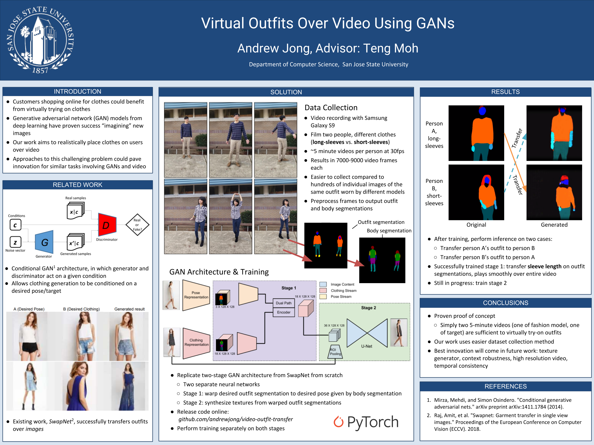

# Video Outfit Transfer
This research project aims to extend the [SwapNet](http://www.eye.gatech.edu/swapnet/paper.pdf) outfit transfer work, by extending realistic outfit transfer to video. Video presents unique challenges related to temporal coherence. This was my project for CS 256: Topics in AI, and is continued as research under Dr. Teng-Sheng Moh.

Please see the
[preprint paper](https://github.com/andrewjong/video-outfit-transfer/blob/master/Video_Outfit_Transfer_Preprint.pdf)
for current progress.

